# Portfolio Project — TMDB Data Pipeline

## Objective

A batch pipeline that ingests movie data from the TMDB API, transforms it into layers, and delivers a dashboard with trends, popularity, ratings, and analytical insights across genres, budgets, box office performance, and regional film production.

The pipeline is designed around a key architectural decision: **separating hot data from cold data**. Most movie metadata is historical and static — it does not change after release. Only a small subset of fields (popularity, ratings, vote count) fluctuates over time. This separation drives the ingestion frequency strategy and avoids unnecessary API calls and processing costs.

Currently, the project is in the Minimum Viable Product (MVP) phase. The initial GCP infrastructure was manually provisioned to validate Python extraction, Airflow orchestration, and dbt transformations, ensuring the data flow works from end to end.

---

## Data Architecture (Data Lakehouse)

The data flow follows the Modern Data Stack pattern, replacing intermediate transactional databases with a Data Lake in Google Cloud Storage:

1. **Extraction:** Python scripts extract data from the TMDB API and save the raw files (`.json` format) in a GCS bucket (Landing Zone).
2. **Ingestion:** Apache Airflow orchestrates the transfer from GCS to the BigQuery Bronze layer using the native `GCSToBigQueryOperator`.
3. **Transformation:** dbt Core processes the data within BigQuery, promoting it to the Silver and Gold layers.
4. **Visualization:** Looker Studio directly consumes the Gold layer to feed the dashboards.

---

## Tech Stack

| Tool | Function |
|---|---|
| **TMDB API** | Free data source |
| **Python** | Extraction scripts and pagination handling |
| **Google Cloud Storage** | Data Lake / Landing Zone (Raw files) |
| **Apache Airflow** | Task orchestration (Local Docker) |
| **BigQuery** | Data Warehouse (GCP free tier) |
| **dbt Core** | Data transformation, quality, and documentation |
| **Looker Studio** | Final dashboard for consumption |
| **GitHub** | Code versioning and portfolio |

---

## Hot Data vs Cold Data

A core architectural decision in this project is distinguishing between data that changes frequently and data that is essentially static after a film's release.

### 🔥 Hot Data — changes regularly
| Field | Why it changes |
|---|---|
| `popularity` | Fluctuates daily based on searches and user interactions on TMDB |
| `vote_average` | Grows as more users submit ratings |
| `vote_count` | Increments continuously |

### 🧊 Cold Data — static after release
| Field | Why it is static |
|---|---|
| `budget`, `revenue` | Historical financial data, rarely corrected |
| `genres`, `runtime` | Fixed after film release |
| `production_countries`, `original_language` | Never changes |
| `credits` (cast, director) | Fixed after release |
| `release_date`, `title` | Immutable |

This distinction drives the ingestion frequency design: cold data is loaded once historically and refreshed only when TMDB reports a change. Hot data is updated on a daily or weekly cadence.

---

## Ingestion Strategy by Frequency

### 🗂️ One-time (Historical Setup)
- Download the **TMDB Daily ID Export** — a `.gz` file published daily at:
  ```
  http://files.tmdb.org/p/exports/movie_ids_MM_DD_YYYY.json.gz
  ```
  This file contains all movie IDs in the TMDB database (hundreds of thousands of entries).
- Filter by a minimum popularity threshold to avoid obscure entries with no analytical value.
- For each ID, call `/movie/{id}` and `/movie/{id}/credits` to build the full historical base.
- Save raw JSONs partitioned by ID range in GCS.

### 📅 Daily (Hot Data Refresh)
- `/trending/movie/day` — updates trending rankings
- `/movie/popular` — refreshes current popularity scores
- `/movie/now_playing` — tracks what is currently in theaters
- Target: top ~1,000 most relevant films updated daily for dashboard freshness

### 🗓️ Monthly (Incremental Cold Data)
- `/movie/changes` — returns only IDs that TMDB flagged as modified in the last X days
- For each changed ID, re-fetch `/movie/{id}` and `/movie/{id}/credits`
- Updates corrections to budget, revenue, credits, or metadata without reprocessing the full dataset

### 🛠️ Data Transformation (dbt)
- `dbt_transform_dag` runs daily at **06:30 AM**, exactly 30 minutes after the daily extraction finishes.
- Rebuilds all Silver views and Gold tables ensuring dashboards are powered by the freshest data without overlapping with the heavy monthly extraction run.

---

## TMDB Endpoints Used

| Endpoint | Description | Frequency | Data Type |
|---|---|---|---|
| TMDB Daily Export (`.gz`) | Full list of all movie IDs | One-time | Cold |
| `/movie/{id}` | Full details: genre, budget, revenue, runtime, release date, origin country, languages, companies | One-time + Monthly incremental | Cold |
| `/movie/{id}/credits` | Cast and director | One-time + Monthly incremental | Cold |
| `/genre/movie/list` | Full genre list with IDs | One-time | Cold |
| `/trending/movie/day` | Daily trending movies | Daily | Hot |
| `/movie/popular` | Currently popular movies | Daily | Hot |
| `/movie/now_playing` | Movies currently in theaters | Daily | Hot |
| `/movie/changes` | Recently changed IDs for incremental refresh | Monthly | Hot → triggers Cold re-fetch |

> **Note:** `/movie/{id}` is the richest endpoint. It returns `production_countries`, `original_language`, `budget`, `revenue`, `vote_average`, `vote_count`, `release_date`, `genres`, and `runtime` — covering the majority of dashboard questions.

---

## GCS Bucket Structure

The bucket is organized by data type, mirroring the endpoint that generated each file. Every folder receives data from a specific Python script and feeds a specific Bronze table in BigQuery.

```
gs://tmdb-data-pipeline/
│
├── raw/
│   │
│   ├── movie_ids/
│   │   └── 2026-07-02.json.gz         ← TMDB Daily Export (.gz)
│   │                                     Script: load_movie_ids.py
│   │                                     Frequency: one-time
│   │                                     BQ Bronze: raw_movie_ids
│   │
│   ├── movies/
│   │   └── 2026-07-02/
│   │       ├── 550.json               ← /movie/{id}
│   │       └── 551.json                  Script: load_movie_details.py
│   │                                     Frequency: one-time + monthly incremental
│   │                                     BQ Bronze: raw_movies
│   │
│   ├── credits/
│   │   └── 2026-07-02/
│   │       ├── 550.json               ← /movie/{id}/credits
│   │       └── 551.json                  Script: load_movie_details.py (same run)
│   │                                     Frequency: one-time + monthly incremental
│   │                                     BQ Bronze: raw_credits
│   │
│   ├── genres/
│   │   └── genres.json                ← /genre/movie/list
│   │                                     Script: load_genres.py
│   │                                     Frequency: one-time
│   │                                     BQ Bronze: raw_genres
│   │
│   ├── trending/
│   │   └── 2026-07-02.json            ← /trending/movie/day
│   │                                     Script: load_trending.py
│   │                                     Frequency: daily
│   │                                     BQ Bronze: raw_trending
│   │
│   ├── popular/
│   │   └── 2026-07-02.json            ← /movie/popular
│   │                                     Script: load_trending.py (same run)
│   │                                     Frequency: daily
│   │                                     BQ Bronze: raw_popular
│   │
│   └── now_playing/
│       └── 2026-07-02.json            ← /movie/now_playing
│                                         Script: load_trending.py (same run)
│                                         Frequency: daily
│                                         BQ Bronze: raw_now_playing
```

### Design Decisions
- **One file per date** — enables reprocessing a specific day without touching others
- **One folder per endpoint** — clear lineage from source to storage to BigQuery
- **Credits saved separately from movies** — different schema, different Bronze table, easier to load independently
- **`load_movie_details.py` handles both `/movie/{id}` and `/movie/{id}/credits`** — they are always fetched together in the same loop, so it makes sense to keep them in one script but save to separate folders
- **`load_trending.py` handles popular, trending and now_playing** — all three are hot data, daily, and follow the same pagination pattern

---

## dbt Project Structure

The data transformation layer is built with dbt Core, following the Medallion Architecture. The project is isolated in its own directory and triggered by Airflow.

```text
dbt/tmdb_project/
├── dbt_project.yml                 ← Main project config (defines schemas silver/gold)
├── profiles.yml                    ← BigQuery connection credentials
├── macros/
│   └── generate_schema_name.sql    ← Macro to enforce strict schema names
└── models/
    ├── staging/                    ← 🥈 Silver Layer (cleanses Bronze data)
    │   ├── sources.yml             ← Maps BigQuery Bronze tables
    │   ├── schema.yml              ← Data Quality tests (unique, not_null)
    │   ├── stg_movies.sql
    │   ├── stg_genres.sql
    │   └── stg_movie_genres.sql
    │
    └── marts/                      ← 🥇 Gold Layer (business logic and aggregations)
        ├── schema.yml              ← Data Dictionary for BI consumption
        ├── mart_genre_by_decade.sql
        └── mart_budget_over_time.sql
```

## Dashboard Metrics & Analytical Questions

The Gold layer was specifically designed to answer the following business questions in Looker Studio:

### 💰 Financial & Box Office Performance
- **Budget vs Revenue per film:** What is the absolute profit and ROI (Return on Investment) for every movie? (`mart_movie_financials`)
- **Budget Inflation over Time:** How has the average budget of films evolved across decades? (`mart_budget_over_time`)
- **ROI by Genre:** Which cinematic genres are the most profitable on average? (`mart_genre_performance`)
- **ROI by Production Company:** Which studios yield the highest average ROI on their film investments? (`mart_company_performance`)

### 🎬 Cast & Crew Insights
- **Top Actors:** Which actors appear most frequently in critically acclaimed films and high-popularity hits over the last 5 years? (`mart_actor_performance`)
- **Top Directors:** Which directors deliver the highest average ROI and critical approval? (`mart_director_performance`)
- **Demographics by Genre:** How is cast gender (Female, Male, Non-Binary) distributed across different movie genres? (`mart_demographics_by_genre`)

### 🌍 Global Production & Market Trends
- **Top Producing Countries:** Which countries produce the most films globally? (`mart_country_performance`)
- **Non-English Market Growth:** How fast are non-Portuguese/non-English productions (South American, Asian, African) growing per year? (`mart_country_performance`)

### 📅 Seasonality & Evolution
- **Release Seasonality:** What is the average revenue and volume of movie releases by month? (`mart_release_seasonality`)
- **Runtime Evolution:** Are movies getting longer or shorter on average across the decades? (`mart_runtime_evolution`)
- **Top Genre by Decade:** Which single genre dominated each decade by volume of releases? (`mart_genre_by_decade`)

### 🔥 Current Hot Data
- **Trending & Popular Now:** What are the most popular and trending films this week/month, enriched with their specific genres? (`mart_trending_now`)

---

## 📊 Dashboard & Visualization Strategy (Looker Studio)

To ensure the Looker Studio dashboard is clean, professional, and language-agnostic, the following Data Viz principles were applied directly in the data warehouse layer (dbt):
- **Decadal vs Yearly Aggregation:** Line and bar charts spanning 100+ years (like budget evolution) were clustered into `decades` instead of exact years. This prevents chart clutter and delivers a clearer macro-trend narrative.
- **Top 1 Filtering (QUALIFY):** Instead of plotting 19 intersecting lines for genre trends, the SQL isolates only the #1 Most Produced Genre per decade, ensuring clean Data Table visualizations.
- **English Language Standardization:** Native TMDB genres and internal gender classifications were translated from Portuguese to English via SQL `CASE WHEN` statements in the Silver layer. This prevents Looker Studio from automatically localizing terms and guarantees a uniform English dashboard for international audiences.
- **Hardcoded Date Labels:** Months are extracted as numerical dimensions (`1-12`) for strict chronological sorting, alongside hardcoded string names (`month_name_en`) to display properly on the X-axis regardless of the user's browser language.

---

## Data Modeling: Medallion Architecture

### 🥉 Bronze Layer (Raw)
- Raw data from the API, loaded in its original format.
- Tables partitioned by ingestion date for historical tracking.
- Main tables: `raw_movies`, `raw_credits`, `raw_genres`, `raw_trending`, `raw_popular`, `raw_now_playing`, `raw_movie_ids`.

### 🥈 Silver Layer (Staging)
- Null data cleansing, type standardization, and entity separation.
- Explodes nested fields (e.g., `genres`, `credits`) into separate relational tables.
- dbt models:
  - `stg_movies.sql` — core movie attributes
  - `stg_genres.sql` — genre dimension
  - `stg_movie_genres.sql` — bridge table (movie ↔ genre)
  - `stg_credits_cast.sql` — unnested actors with gender mapping
  - `stg_credits_crew.sql` — unnested directors
  - `stg_movie_companies.sql` — unnested production companies
  - `stg_movie_countries.sql` — unnested production countries
  - `stg_trending.sql` & `stg_popular.sql` — hot data snapshots

### 🥇 Gold Layer (Marts)
- Aggregated facts and dimensions ready for direct dashboard consumption.
- dbt models:
  - `mart_movie_financials.sql` — budget, revenue, and ROI per film
  - `mart_genre_performance.sql` — ROI and box office by genre
  - `mart_company_performance.sql` — ROI and volume by production company
  - `mart_actor_performance.sql` — actors' frequency in highly rated and popular films
  - `mart_director_performance.sql` — director rankings by average ROI
  - `mart_demographics_by_genre.sql` — cast gender distribution per genre
  - `mart_country_performance.sql` — production volume and language growth by country
  - `mart_release_seasonality.sql` — revenue and volume averages per month
  - `mart_runtime_evolution.sql` — average runtime trends across decades
  - `mart_trending_now.sql` — combined trending and popular films enriched with genres

---

## Implemented Data Engineering Best Practices

**Materialization Strategy (Views vs Tables)**
To optimize BigQuery costs and performance, dbt was configured with distinct materialization strategies per layer. The **Silver layer** is materialized as `view` to avoid duplicating raw data in storage, acting as a lightweight virtual lens for data cleaning. The **Gold layer** is materialized as `table`, physically persisting the results of heavy JOINs and complex aggregations. This guarantees that BI tools and dashboards experience instant load times without triggering expensive, repetitive query processing on every click.

**Hot vs Cold Data Separation**
The pipeline distinguishes between fields that change frequently (popularity, ratings) and fields that are static after release (budget, credits, genres). This avoids full reloads and reduces unnecessary API calls, reflecting a production-grade architectural decision.

**Data Quality Tests**
Configured native dbt tests (`schema.yml`) in the Silver and Gold layers to ensure data reliability. Rules applied include uniqueness (`unique`) and non-null (`not_null`) tests for primary keys, plus value restrictions (e.g., `vote_average` between 0 and 10, `budget >= 0`, `revenue >= 0`).

**Vote Count Filtering**
All rating-based aggregations apply a minimum `vote_count` threshold (e.g., `>= 100 votes`) to avoid statistical noise from films with very few reviews.

**DAG Idempotency**
Airflow DAGs were designed to be idempotent. Date partitioning and the use of incremental materializations in dbt ensure that failure re-executions do not duplicate data in BigQuery.

**Resilience and Rate Limiting**
Implementation of Retry and Exponential Backoff strategies (via the Tenacity library) in Python scripts. This prevents pipeline failures when hitting API request limits (HTTP 429).

**Credential Security**
Strict use of `Connections` and `Variables` in Airflow, alongside `.env` files managed via `.gitignore`, eliminating any hardcoded API keys or cloud credentials in the public repository.

**Nested Field Handling**
TMDB returns arrays for fields like `genres`, `production_countries`, and `spoken_languages`. The Silver layer explodes these into proper bridge tables, enabling clean many-to-many joins in the Gold layer without data duplication.

**Handling Big Data & Out of Memory (OOM) Prevention**
During the extraction of historical data, the pipeline faced an Out of Memory (OOM) error that crashed the Airflow container. The original script attempted to download the daily export (containing over 1.2 million movie IDs), parse all JSON objects into a Python list, and hold them in RAM simultaneously before uploading to GCS. Similarly, the monthly script tried to download the 150MB file from GCS entirely into memory to filter it. 
To solve this, the extraction logic was refactored to use **Data Streaming**. Instead of loading the payload into memory, the data is now read and decompressed *on the fly*, parsed line-by-line (`blob.open("r")`), and written directly to disk or filtered iteratively. This dropped the RAM consumption from hundreds of megabytes to under 2MB, making the pipeline highly resilient regardless of dataset size.

---

## 🚀 How to Run Locally (MVP)

Currently, we have completed the Python extraction logic and set up the Airflow orchestration infrastructure using Docker. Follow these steps to run the project on your local machine:

### 1. Environment Setup (`.env`)
In the root directory of the project, create a file named `.env` containing your TMDB API keys, GCS bucket name, and Airflow credentials:

```env
TMDB_API_KEY=your-api-key
TMDB_ACCESS_TOKEN=your-read-access-token

GCS_BUCKET_NAME=your-bucket-name
GCP_PROJECT_ID=your-gcp-project-id
GOOGLE_APPLICATION_CREDENTIALS=/opt/airflow/credentials-tmdb.json

# --- Airflow Config ---
AIRFLOW_DB_USER=airflow
AIRFLOW_DB_PASSWORD=airflow
AIRFLOW_UI_USER=admin
AIRFLOW_UI_PASSWORD=admin
```

> **Note:** You will also need a `credentials-tmdb.json` file in the root directory containing your Google Cloud Service Account key.

### 2. Starting the Infrastructure with Docker
The orchestrator (Apache Airflow) is containerized via `docker-compose`. To build and start the containers, ensure you are in the root directory and run:

```bash
docker-compose --env-file .env -f infra/docker-compose.yml up -d --build
```

This command will:
- Pull the Postgres and Apache Airflow base images.
- Build the custom image (`Dockerfile`), installing Python dependencies from `requirements.txt`.
- Start the Database, Scheduler, and Webserver in the background (`-d`).

### 3. Accessing the Airflow UI
Once the containers are up and healthy, you can access the Airflow graphical interface in your browser:

- **URL:** `http://localhost:8080`
- **Username:** `admin` (as configured in `.env`)
- **Password:** `admin` (as configured in `.env`)

Your local `dags/` folder is mapped as a volume. Any DAG script you create locally will automatically sync and appear in the Airflow dashboard.

> **Airflow DAG Execution:**
> 
> Our data pipeline is orchestrated by 3 specific DAGs to manage different ingestion cadences (Historical backfill, Monthly updates, and Daily trending snapshots).
> 
> **1. Historical / dbt Build Pipeline:**
> 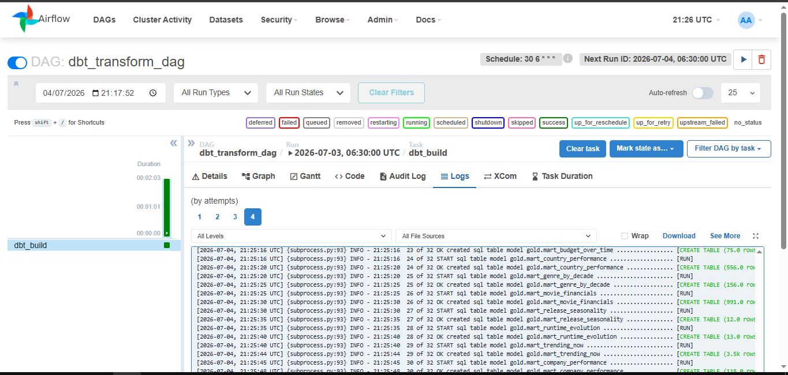
> 
> **2. Monthly Pipeline (Incremental load):**
> 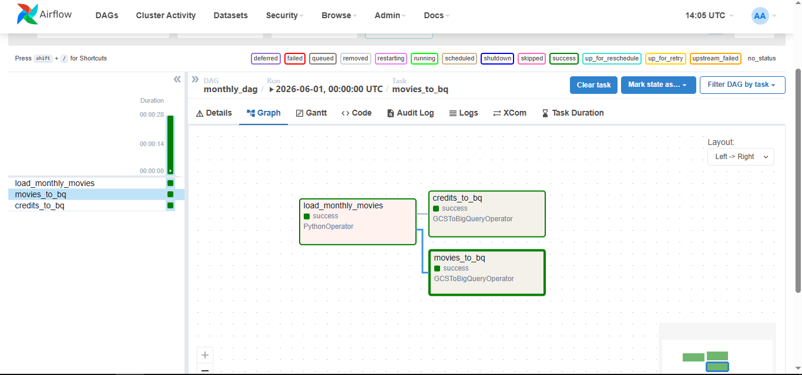
> 
> **3. Daily Pipeline (Trending & Popular updates):**
> 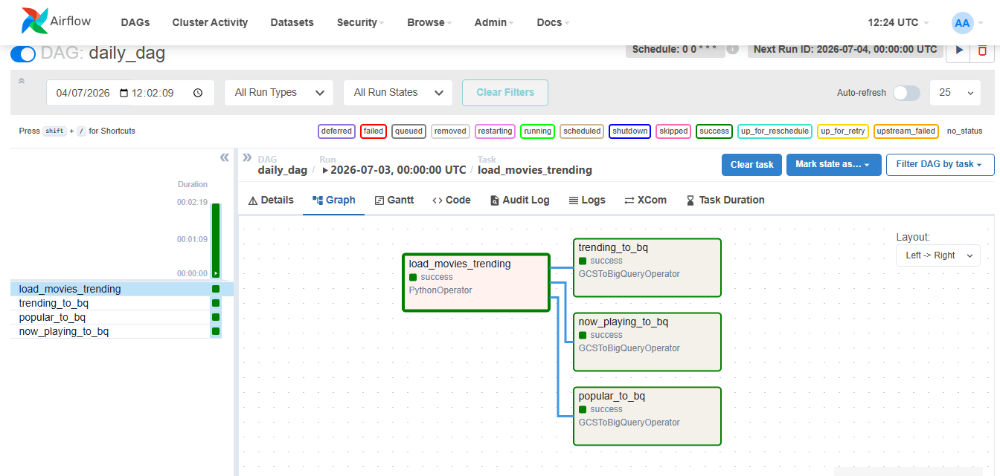

To stop the infrastructure and free up your PC's resources, run:
```bash
docker-compose -f infra/docker-compose.yml down
```

---

## 📈 Analytics Results (Looker Studio)

> **Disclaimer & Data Snapshot:** All data visualizations and aggregations below are based on a curated sample of the TMDB database, specifically filtered for movies with `popularity > 10` during the initial API extraction. Furthermore, the complete data extraction was executed on **July 4, 2026**. Therefore, the metrics, box office numbers, and trending charts reflect the state of the cinema industry exactly on that date.

Below are the final visualizations built in Looker Studio, directly consuming the 12 Gold layer tables from BigQuery. Each chart provides a clear and actionable insight into a specific area of the cinema industry.

### 💰 Financial & Box Office Performance
- **Budget Inflation over Time:**
  > 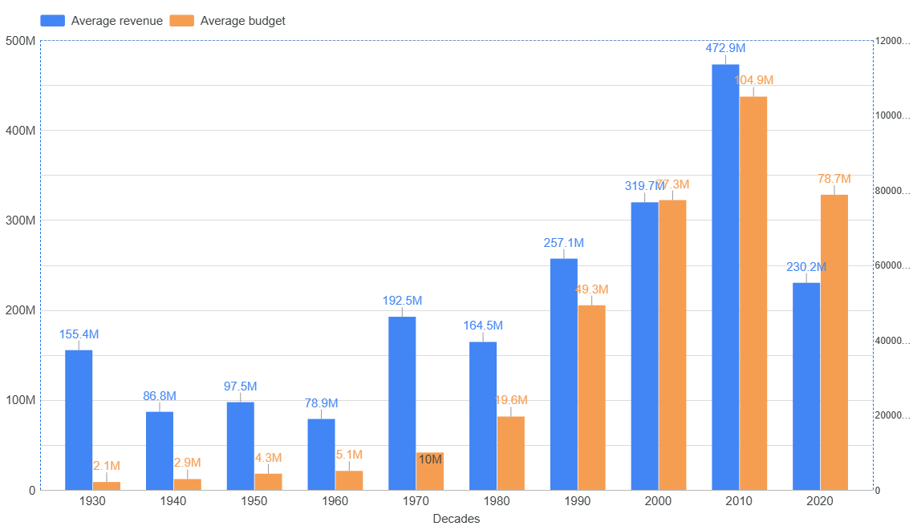
  
- **Movie Financials & ROI:**
  > 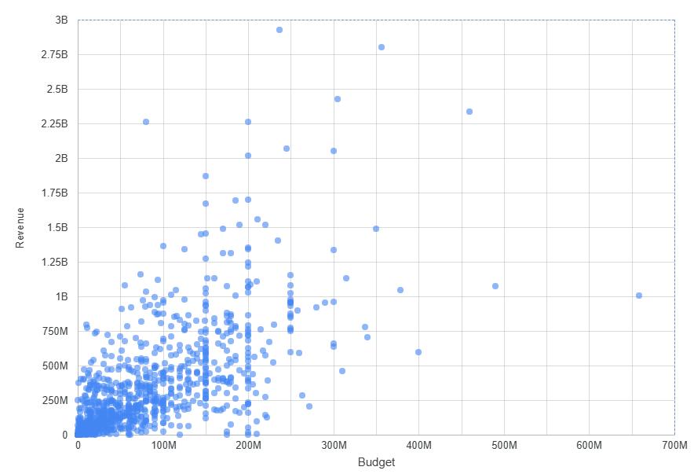
  > 
  > **Interesting Outliers Discovered:**
  > - **Highest Budget:** *Jurassic World Dominion* stood out as an extreme outlier for production costs.
  >   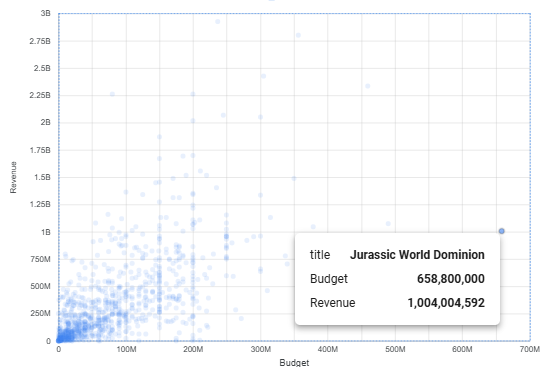
  > - **Highest Revenue:** Unprecedented box office returns.
  >   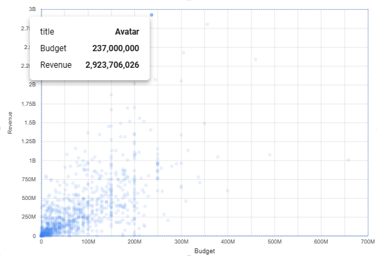
  > - **Highest ROI (Ne Zha):** This specific film emerged as a massive anomaly, demonstrating how an incredibly low budget can yield astronomical box office revenue, resulting in a phenomenal ROI.
  >   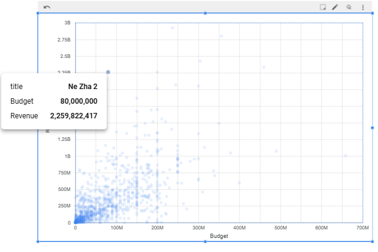

- **ROI by Genre:**
  > 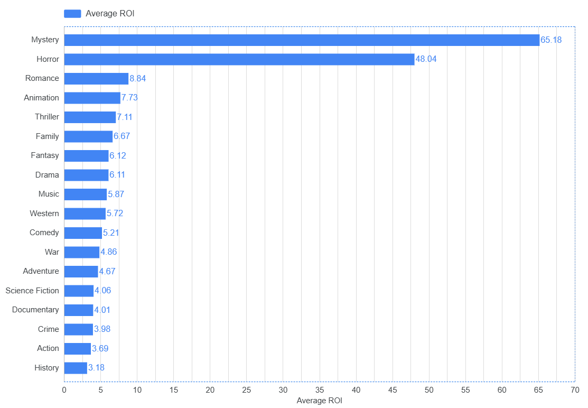
  
- **Production Company Performance:**
  > *Analysis based on Total Revenue generated:*
  > .png)
  > *Analysis based on average Return on Investment (ROI):*
  > .png)

### 🎬 Cast, Crew & Demographics
- **Demographics by Genre:**
  > 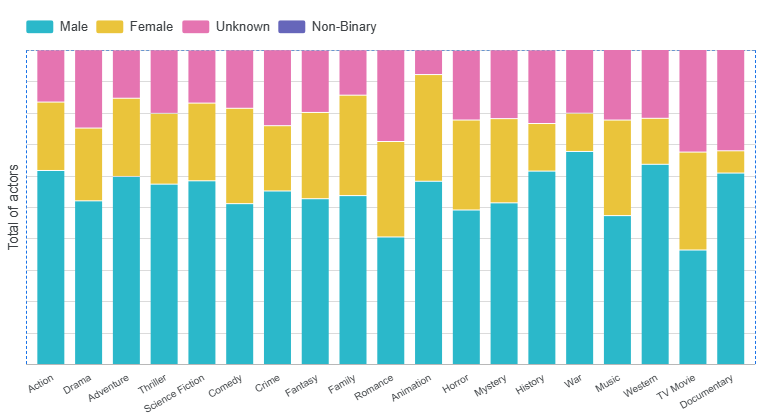
- **Top Actors Performance:**
  > 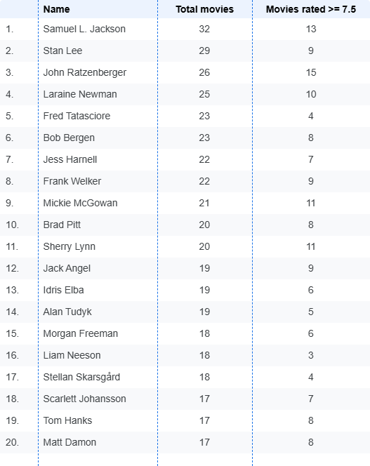
- **Top Directors by Average Rating:**
  > *Directors ordered by their critical acclaim (Average Rating), also showcasing their total movie count and box office performance.*
  > 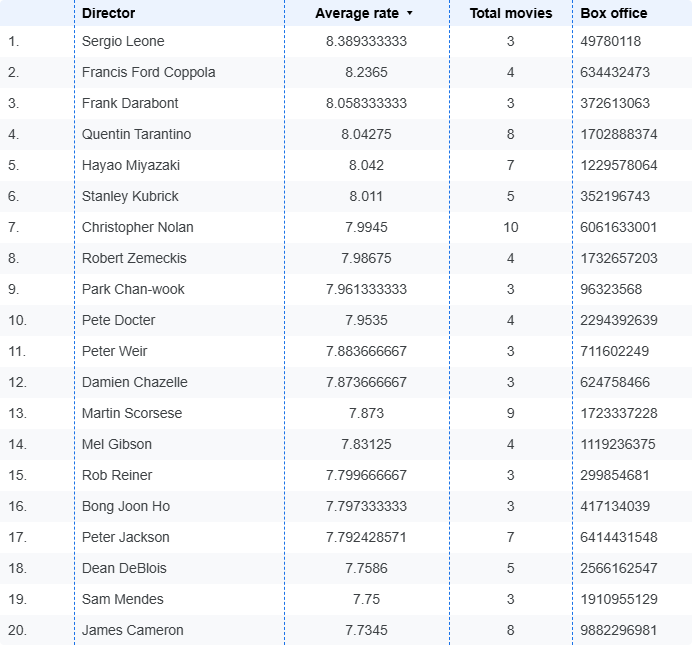

### 🌍 Global Market & Seasonality
- **Top Producing Countries:**
  > 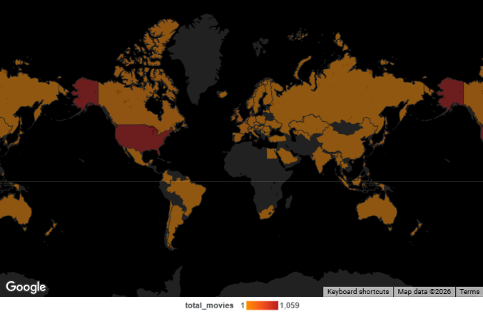
- **Release Seasonality:**
  > 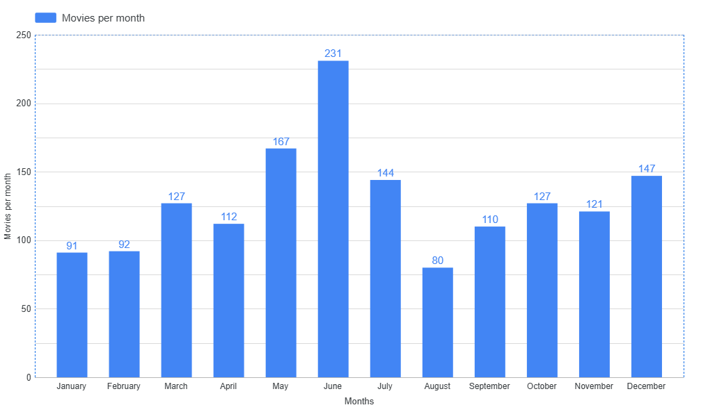
- **Runtime Evolution:**
  > 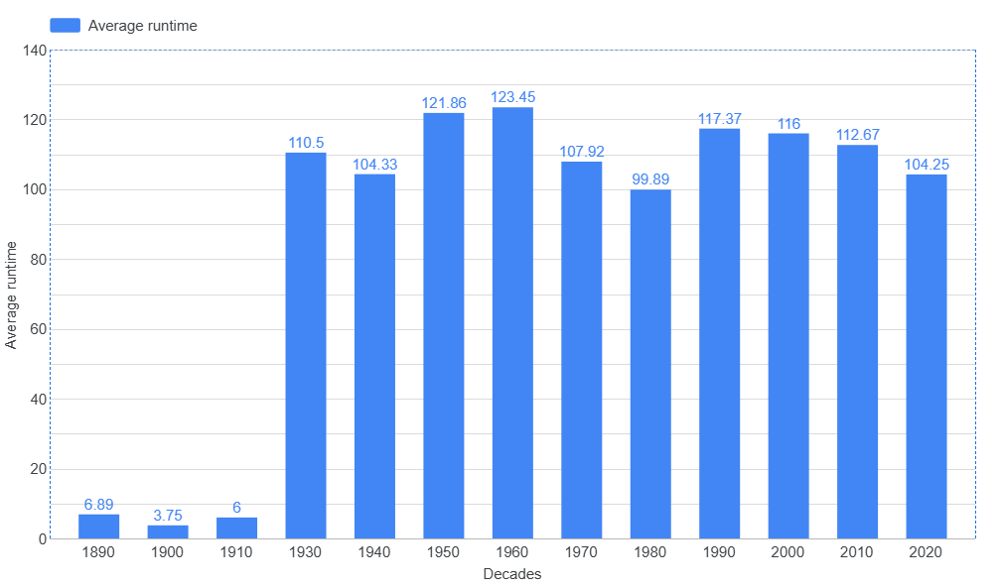
- **Top Genre by Decade:**
  > 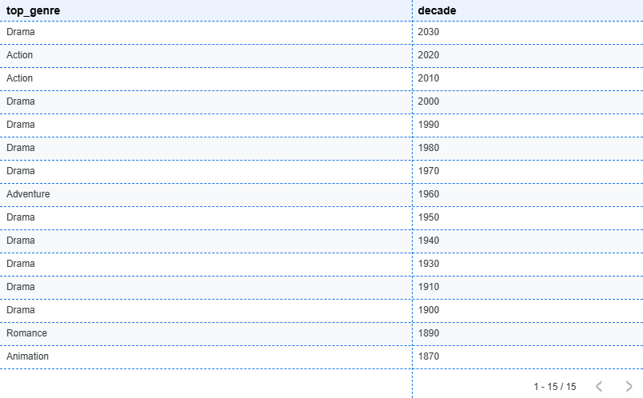

### 🔥 Current Hot Data
- **Trending & Popular Now:**
  > 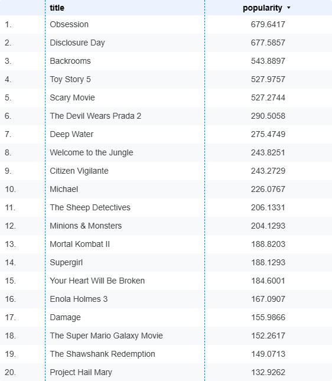